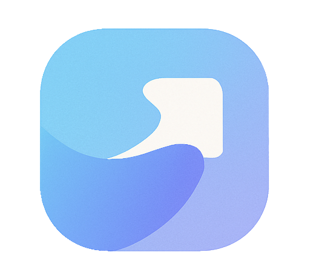
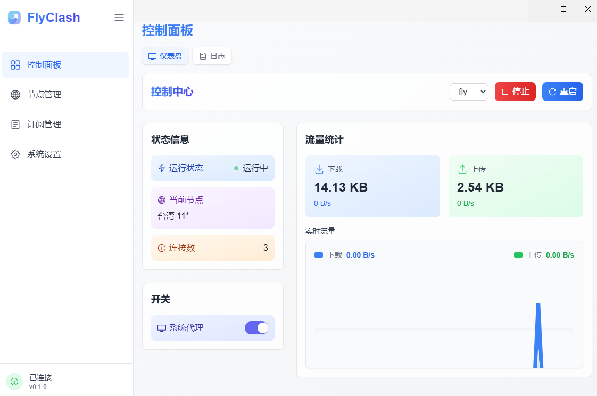
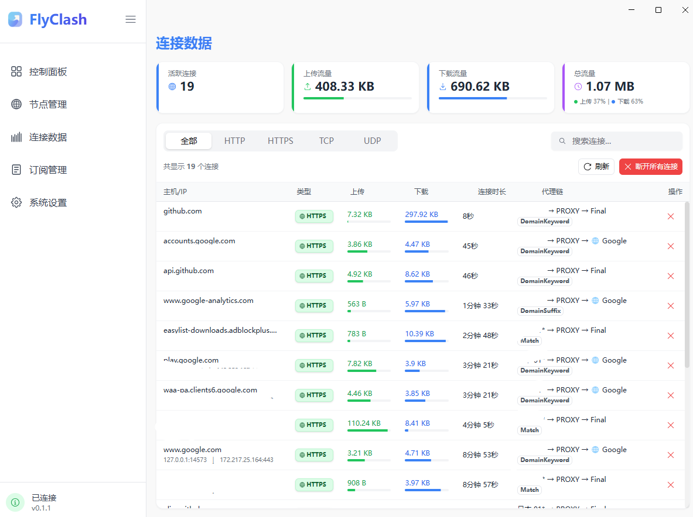
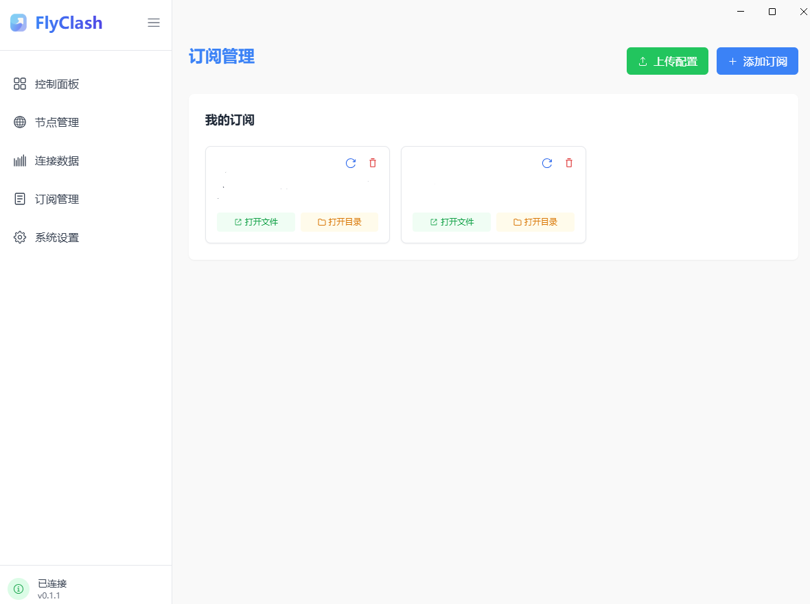
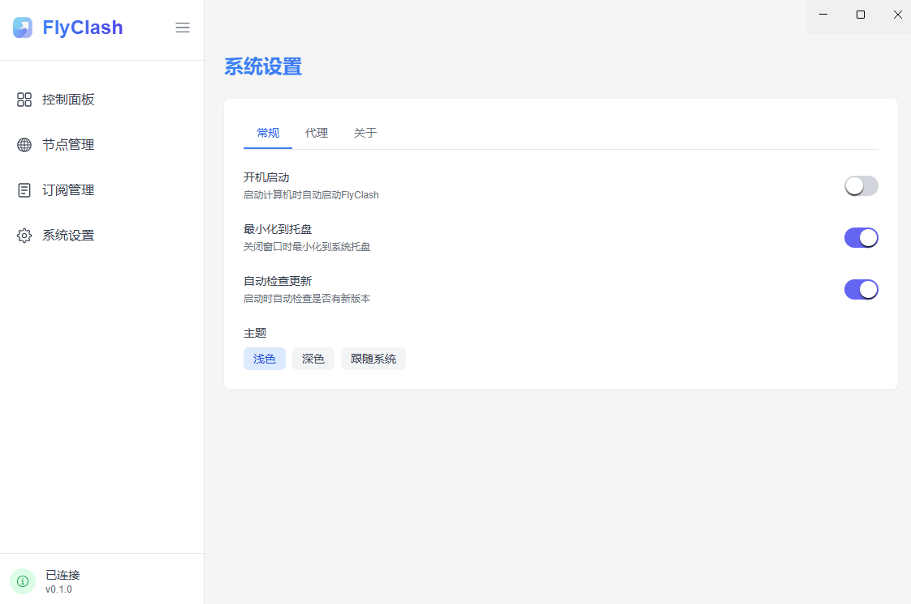

<p align="center">
  
</p>

# FlyClash - 简洁优雅的代理工具

FlyClash是一个基于Mihomo内核的现代化代理客户端，拥有美观的界面和强大的功能。

## 功能特点

- 🚀 集成最新的Mihomo内核
- 📊 简洁直观的控制面板
- 🔧 方便的订阅管理
- 🌐 支持系统代理切换
- 💡 明暗主题适配
- 🔔 托盘图标支持
- 🎨 基于现代设计语言

## 交流社区

加入我们的 [Telegram 交流群](https://t.me/flyclash) 获取最新消息、使用帮助和与其他用户交流。

## 截图







## 安装

### 从发布版下载

访问[发布页面](https://github.com/GtxFury/FlyClash/releases)下载最新版本的安装包。

### 从源码构建

```bash
# 克隆仓库
git clone https://github.com/GtxFury/FlyClash.git
cd flyclash

# 安装依赖
npm install

# 开发模式运行
npm run electron:dev

# 构建安装包
npm run electron:build
```

## 使用方法

1. 添加订阅：在"订阅管理"页面添加您的订阅链接
2. 选择配置：在控制面板选择添加的配置文件
3. 启动服务：点击"启动"按钮开始代理服务
4. 系统代理：通过系统托盘菜单启用/禁用系统代理

## 常见问题

### 无法启动Mihomo内核

确保您没有其他同类软件占用了相同的端口（默认7890）。

### 系统代理设置失败

请尝试以管理员身份运行FlyClash，或手动设置系统代理。

## 致谢

- [Mihomo](https://github.com/MetaCubeX/mihomo) - 优秀的代理内核
- [Next.js](https://nextjs.org) - React框架
- [Electron](https://www.electronjs.org) - 桌面应用框架
- [Radix UI](https://www.radix-ui.com) - 无障碍UI组件
- [Tailwind CSS](https://tailwindcss.com) - CSS框架

## 许可证

[MIT License](LICENSE)
